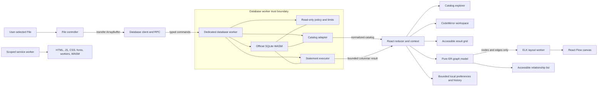
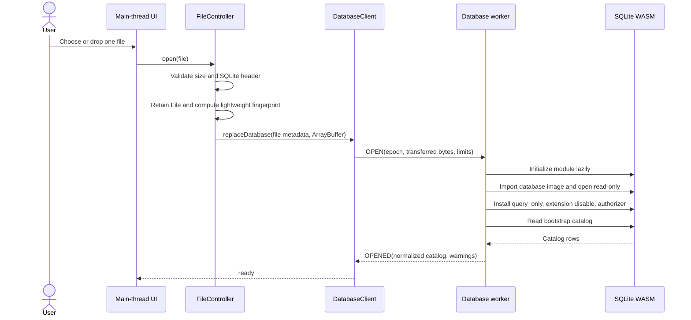
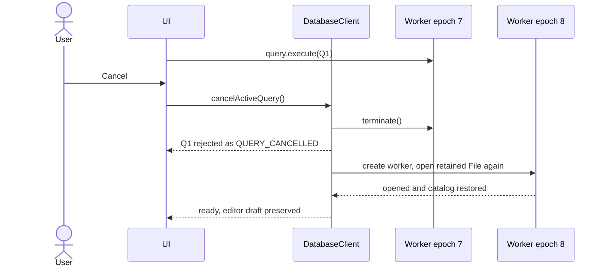

# Architecture Research: SeeQLite

**Domain:** Browser-only SQLite explorer and query workbench
**Researched:** 2026-07-15
**Overall confidence:** HIGH for component boundaries and worker behavior; MEDIUM for the final byte-import helper and tuning constants, which require implementation spikes against the pinned SQLite WASM build.

## Executive Decision

Build SeeQLite as a static React application with two isolated workers:

1. A database worker owns the official SQLite WASM module, the open connection, catalog extraction, policy enforcement, query execution, result bounding, and query-plan generation.
2. A diagram-layout worker owns ELK layout only. It never receives database bytes or result rows.

The browser main thread owns the `File`, editor draft, normalized UI state, bounded history, and rendered catalog/result/diagram views. It never receives a SQLite handle and never decides whether SQL is safe. All database commands cross one typed request-response boundary and are processed serially.

This keeps the trust boundary small, makes a stuck query disposable, and avoids the deprecated SQLite Worker1/Promiser interfaces. It also preserves the useful DataDuck patterns: lazy engine startup, explicit file cleanup, a small state boundary, relative Pages assets, and an offline app shell.

## Recommended Architecture



### Component Boundaries

| Component | Owns | Must not own | Communicates with |
|---|---|---|---|
| `FileController` | File picker/drop validation, header check, size policy, retained `File`, reopen | SQLite APIs, SQL policy | `DatabaseClient`, UI state |
| `DatabaseClient` | Worker lifecycle, request IDs, epochs, pending promises, normalized errors, recovery | SQL parsing or safety decisions | File controller, database worker |
| `sqlite.worker.ts` | SQLite initialization, one connection, serial command dispatcher | React state, DOM, persistence | `DatabaseClient`, SQLite WASM |
| `ReadOnlyPolicy` | Authorizer callback, read-only PRAGMA allowlist, statement checks, deadlines and limits | UI affordances | Worker executor |
| `CatalogAdapter` | `sqlite_schema` and PRAGMA extraction, normalization, catalog budgets | Diagram layout or rendering | SQLite, worker dispatcher |
| `QueryExecutor` | Single-statement preparation, stepping, type conversion, result budgets, plan requests | Client sorting, export formatting | SQLite, worker dispatcher |
| App reducer/context | Database lifecycle state, active object, editor/result/diagram view state | SQLite handles or copied file bytes | UI components, clients |
| `GraphModel` | Tables, fields, grouped FK edges, relationship list, join template inputs | Canvas positions or SQL execution | Catalog, layout client, diagram UI |
| `diagram-layout.worker.ts` | ELK input/output and layout cancellation | SQLite, schema extraction, persistence | Diagram layout client |
| Persistence adapter | Theme, UI preferences, bounded SQL history, bounded diagram positions | Database bytes, results, schema snapshots | App state |
| Service worker | Versioned application-shell cache within `./seeqlite/` | User files or query results | Browser Cache Storage only |

## Database Lifecycle

Use a single explicit state machine. Components render from this state instead of inferring readiness from scattered booleans.

```text
empty -> validating -> opening -> ready -> running -> ready
                   \-> failed             \-> recovering -> ready
ready -> closing -> empty                  \-> failed
```

### Open Sequence



Rules:

- One database is open at a time. Opening another file terminates or closes the existing worker before importing the next one.
- Extension checks are advisory. The `SQLite format 3\0` header and SQLite open result are authoritative.
- Reject zero-byte, undersized, over-limit, corrupt, and encrypted-looking files with distinct actionable errors where detection is reliable.
- Warn at 256 MiB and hard-stop at 512 MiB as initial policy. Treat 512 MiB as an upper bound, not a compatibility promise. A memory-constrained browser may fail earlier and must return `OUT_OF_MEMORY` without retry loops.
- Retain the browser `File`, not a second loaded byte buffer, on the main thread. Read it again only when cancellation recovery needs a fresh transferable `ArrayBuffer`.
- Sidecar `.wal` and `.shm` files are not imported in v1. If the main database reports WAL mode, explain that uncheckpointed sidecar changes are not represented and recommend opening a checkpointed copy.
- Close/failure must finalize every statement, close the connection, release WASM allocations, reject pending RPC calls, and terminate the worker.

### Database Import Spike

The preferred design is an in-memory database image using the C API `sqlite3_deserialize()` with `SQLITE_DESERIALIZE_READONLY` and ownership transferred to SQLite. This provides a hard engine-level read-only layer and avoids OPFS/header requirements.

Before Phase 2 commits to the helper, spike the exact API exported by the pinned `@sqlite.org/sqlite-wasm` version:

1. Verify allocation and `SQLITE_DESERIALIZE_FREEONCLOSE` ownership behavior.
2. Verify corrupt, WAL-mode, `STRICT`, `WITHOUT ROWID`, virtual-table, and large fixtures.
3. Measure peak memory during ArrayBuffer transfer, WASM copy, and close.
4. If the packaged wrapper makes deserialize unsafe or unsupported, use the package's transient in-memory VFS file helper and open that file with SQLite read-only flags. Keep the public worker contract unchanged.

Do not adopt OPFS for v1. It adds persistence, locking, isolation-header, cleanup, and cross-tab concerns without improving the core direct-file workflow.

## Worker RPC Contract

Use a discriminated union shared by main thread and worker. The envelope is intentionally smaller than a general worker framework.

```typescript
type RequestEnvelope<T extends DbCommand> = {
  requestId: string;
  epoch: number;
  command: T;
};

type DbCommand =
  | { type: 'open'; file: FileMetadata; bytes: ArrayBuffer; limits: RuntimeLimits }
  | { type: 'catalog.bootstrap' }
  | { type: 'catalog.object'; objectId: string }
  | { type: 'query.execute'; queryId: string; sql: string; deadlineMs: number }
  | { type: 'query.explain'; queryId: string; sql: string }
  | { type: 'close' };

type ResponseEnvelope<T> =
  | { requestId: string; epoch: number; ok: true; result: T }
  | { requestId: string; epoch: number; ok: false; error: DbError };

type DbError = {
  code:
    | 'INVALID_FILE' | 'UNSUPPORTED_ENCRYPTION' | 'FILE_TOO_LARGE'
    | 'CORRUPT_DATABASE' | 'OUT_OF_MEMORY' | 'NOT_READY'
    | 'MULTIPLE_STATEMENTS' | 'PARAMETERS_UNSUPPORTED' | 'WRITE_DENIED'
    | 'RESULT_LIMIT' | 'QUERY_TIMEOUT' | 'QUERY_CANCELLED'
    | 'WORKER_CRASHED' | 'SQLITE_ERROR';
  message: string;
  sqliteCode?: number;
  position?: { offset: number };
  recoverable: boolean;
};
```

Contract rules:

- `requestId` resolves exactly one promise. Unknown or duplicate response IDs are ignored and logged in development.
- `epoch` identifies a worker generation. Responses from an old epoch can never update current UI state.
- The worker processes one command at a time. The client deduplicates catalog-detail requests and disables query submission while a query is running.
- Transfer file buffers with the transfer list. Do not structured-clone duplicate database bytes.
- Error messages shown to users are normalized. Development diagnostics may include a stack, but persisted history does not.
- The worker is the only policy authority. Client-side SQL inspection may improve UX but is never security enforcement.

## Read-Only Enforcement

No single SQLite switch is sufficient for the product guarantee. Enforce read-only behavior in layers:

1. Import the database image as deserialized read-only, or open the transient VFS file using read-only flags.
2. Set `PRAGMA query_only=ON` during trusted initialization.
3. Ensure extension loading is disabled and deny `load_extension` through the authorizer/function policy.
4. Install `sqlite3_set_authorizer()` before preparing user SQL.
5. Prepare exactly one statement and require `sqlite3_stmt_readonly()` to return true.
6. Allow only a small named list of read-only PRAGMAs. Deny writable and unknown PRAGMAs.
7. Deny `ATTACH`, `DETACH`, transaction control, savepoints, DDL, DML, `VACUUM`, `ANALYZE`, `REINDEX`, and every unrecognized authorizer action.

The authorizer allowlist should admit `SELECT`, reads, recursive CTEs, core scalar/aggregate functions except `load_extension`, and the explicit catalog PRAGMAs used by SeeQLite. It should deny by default. Unit tests must derive coverage from the SQLite authorizer action constants exposed by the pinned build so a newly exposed action cannot become implicitly allowed.

The UI may display SQL stored in `sqlite_schema`, but it never executes that SQL and never renders it as HTML.

### Single-Statement Preparation

Do not split SQL with regular expressions. Use SQLite's own prepare loop:

1. Prepare the first non-empty statement.
2. Continue preparing the unconsumed tail without stepping anything.
3. Ignore whitespace and comment-only tails that yield no statement.
4. If a second statement exists, finalize all prepared handles and return `MULTIPLE_STATEMENTS`.
5. Reject statements with bind parameters in v1 using the statement parameter count.
6. Run authorizer and `sqlite3_stmt_readonly()` checks before the first `step()`.

Editor behavior stays simple: execute the non-empty selection; otherwise submit the full editor. If the full editor contains more than one statement, ask the user to select one instead of guessing the active statement.

## Query Execution and Bounded Results

The database worker steps statements synchronously and returns one bounded result payload. Do not stream an unbounded row per worker message. A 1,000-row cap makes a single response simpler and faster while preserving duplicate column names.

```typescript
type QueryResult = {
  columns: Array<{ name: string; declaredType?: string; runtimeKinds: string[] }>;
  rows: SqlValue[][];
  elapsedMs: number;
  returnedRows: number;
  truncated: boolean;
  truncationReason?: 'row_limit' | 'byte_limit' | 'cell_limit';
};

type SqlValue =
  | null | number | bigint | string
  | { kind: 'blob'; byteLength: number; preview: Uint8Array }
  | { kind: 'truncated-text'; byteLength: number; preview: string };
```

Use array rows, not objects. SQLite permits duplicate result-column names; object rows silently overwrite values.

Initial central limits, to be tuned by the Phase 3 performance spike:

| Limit | Initial value | Behavior |
|---|---:|---|
| Rows | 1,000 | Step once beyond the cap only to determine `truncated` |
| Columns | 250 | Reject before row iteration with a clear message |
| Serialized result budget | 8 MiB | Stop before copying the cell that exceeds the budget |
| Text copied per cell | 64 KiB UTF-8 | Return marked preview and original byte length |
| BLOB preview | 256 bytes | Inspect `sqlite3_column_bytes()` before copying |
| Automatic query deadline | 30 seconds | Interrupt through a worker-local progress handler |

Always finalize statements in `finally`. Client-side sorting is allowed only over the bounded returned rows and must be labeled as such. CSV/JSON export consumes this exact result model, including truncation metadata; it never re-runs an unbounded query.

`EXPLAIN QUERY PLAN` is a separate command. First validate that the submitted SQL is one permitted read-only, parameter-free statement, then prepare `EXPLAIN QUERY PLAN <statement>`. Return its four columns as a small structured tree/list. SQLite documents the plan detail format as unstable, so tests assert normalized parent/child structure and presence, not exact prose.

## Cancellation and Recovery

A normal `cancel` message cannot interrupt a long synchronous SQLite call in the same worker: the message waits in the worker event queue until the call returns. Build cancellation around that fact.



- Cancellation acknowledgement is a UI/client target under 250 ms. Rehydration time is reported separately and scales with file size.
- A worker-local `sqlite3_progress_handler()` checks `performance.now()` against the query deadline and returns non-zero when expired. This handles automatic timeouts without waiting for a message.
- Do not require `SharedArrayBuffer`, cross-origin isolation, or OPFS solely to support cancellation.
- Preserve editor SQL, selected catalog object, history, and diagram view state across worker replacement. Clear result and plan payloads from the cancelled generation.
- A crash or out-of-memory failure may offer one explicit user-triggered reopen. Do not automatically loop through worker restarts.

## Catalog Extraction

Normalize SQLite metadata once so the explorer, completion source, ER diagram, and join generator do not each interpret PRAGMA rows differently.

### Bootstrap

Read:

- `PRAGMA table_list` for object type, column count, `WITHOUT ROWID`, and `STRICT` flags.
- `sqlite_schema` for table, view, index, and trigger names plus original SQL.
- `PRAGMA schema_version` for cache invalidation within the open session.

Hide `sqlite_%` internals by default, with a user-visible toggle. Do not include the temp schema or attached databases in v1.

### Object Details

Use table-valued PRAGMA functions with bound arguments where supported:

- `pragma_table_xinfo(?)` for ordinary, generated, and hidden columns.
- `pragma_foreign_key_list(?)` for declared foreign keys.
- `pragma_index_list(?)` and `pragma_index_xinfo(?)` for unique/index origin, partial indexes, expressions, and included rowid columns.

Never interpolate raw object names into PRAGMA or generated SQL. Where an identifier is unavoidable, quote with SQLite double quotes and replace each embedded `"` with `""`.

Normalize into stable application types:

```typescript
type Catalog = {
  database: { fingerprint: string; schemaVersion: number };
  objects: CatalogObject[];
  relationships: ForeignKeyRelationship[];
  warnings: CatalogWarning[];
};

type CatalogObject = {
  id: string;                 // main:<type>:<exact name>
  schema: 'main';
  name: string;
  kind: 'table' | 'view' | 'virtual' | 'shadow';
  sql: string | null;
  strict: boolean;
  withoutRowid: boolean;
  columns?: CatalogColumn[];  // lazily populated for explorer
  indexes?: CatalogIndex[];
};

type ForeignKeyRelationship = {
  id: string;                 // child object + FK id
  childObjectId: string;
  parentObjectId?: string;
  columns: Array<{ seq: number; from: string; to?: string }>;
  onUpdate: string;
  onDelete: string;
  match: string;
  resolved: boolean;
};
```

Group composite foreign-key rows by SQLite FK `id` and order them by `seq`; render one relationship edge with multiple column pairs. Preserve self-references, cycles, multiple FKs between the same tables, omitted parent columns, and references to missing tables. Do not infer relationships from names.

Catalog budgets prevent hostile schemas from freezing the tab. Start with 5,000 objects and 50,000 columns total. When exceeded, keep the database open in limited explorer mode, state which budget was reached, and do not attempt a full ER layout. Tune these numbers with generated fixtures before release.

## ER Graph Architecture

The normalized graph is a pure derivation from catalog data. React Flow and ELK are render/layout adapters, not sources of truth.

- Node IDs use exact catalog IDs, not lowercased names.
- Each node carries ordered fields and PK, FK, unique, generated, hidden, and nullability badges.
- Each edge represents one declared FK constraint and stores all ordered column pairs.
- Unresolved references remain visible as warnings instead of being dropped.
- The relationship list consumes the same edge model and is the keyboard/screen-reader equivalent of the canvas.
- Join SQL generation uses graph edge data and the shared identifier quoter. It inserts into an empty editor or asks before replacing a dirty draft.
- ELK runs in its own worker. A new layout request cancels by terminating/replacing that small worker without affecting SQLite.

For 75 or fewer table-like objects, auto-layout the whole graph. Above that threshold, show table search and lay out a selected table plus its connected component, capped at 75 nodes. This is clearer and more performant than rendering hundreds of DOM nodes and crossed edges by default.

Persist only user-adjusted node positions and diagram preferences, keyed by the lightweight database fingerprint plus `schema_version`. A fingerprint is an affinity key, not proof of file identity.

## Application State and Persistence

Use React reducer/context with feature hooks. A global state library is unnecessary for one database and one workspace.

Keep these domains separate:

- **Engine state:** lifecycle, epoch, current request, catalog, result, plan, normalized error.
- **Workspace state:** editor draft/selection, active view, selected object, result sort/page, diagram selection and viewport.
- **Preferences:** theme, rail width/collapse, result page size, reduced-motion preference.
- **History:** at most 100 entries containing SQL, timestamp, success/failure status, elapsed time, and database affinity fingerprint.

Use versioned localStorage records because the payload is small. Catch quota, privacy-mode, and disabled-storage failures and fall back to in-memory session state. Provide clear-history and reset-layout actions.

Never persist database bytes, result rows, catalog snapshots, BLOB previews, worker errors/stacks, or file-system paths. Query text can contain sensitive literals, so history is local-only, bounded, visibly clearable, and excluded from analytics. SeeQLite has no analytics in v1.

## Offline and GitHub Pages Deployment

Build from `SeeQLite/` with Vite `base: './'` and publish at `tinycrafts.ai/seeqlite/`. Construct worker and WASM URLs through bundler-resolved relative assets, never root-absolute paths.

The scoped custom service worker precaches only the versioned application shell:

- HTML, hashed JS/CSS, self-hosted fonts, icons and manifest.
- Database and layout worker bundles.
- SQLite WASM and any required same-origin loader asset.

Use network-first navigation with a precached fallback and cache-first immutable hashed assets. On activation, delete only obsolete SeeQLite cache names. Register with `scope: './'` and `updateViaCache: 'none'`, matching the proven DataDuck deployment pattern.

Do not cache requests created from user data, object URLs, database bytes, query results, or export blobs. Offline capability means the app works after one successful online load; it does not imply that a previously opened database can be reopened without selecting it again.

The core architecture must not depend on COOP/COEP, `SharedArrayBuffer`, custom response headers, or a backend. This is necessary for static GitHub Pages hosting and follows the v1 decision to avoid OPFS.

## Failure Isolation

| Failure | Containment | User recovery |
|---|---|---|
| Invalid extension but valid header | Extension is advisory | Open normally with a small notice |
| Invalid/corrupt/encrypted bytes | Worker open fails before catalog publication | Select a valid unencrypted SQLite file |
| Missing WAL sidecar | Main DB remains isolated; warning recorded | Open a checkpointed database copy |
| SQLite/WASM initialization error | Database worker only | Retry once or reload application shell |
| Query syntax/policy error | Current statement only | Fix SQL; database stays ready |
| Long query | Worker-local deadline or user termination | Worker rehydrates; editor remains intact |
| Result exceeds budget | Statement is finalized; bounded prefix returned | Refine query or add filters/limit |
| Huge schema | Catalog limited mode; no full graph layout | Search/select a subset |
| Layout failure | Layout worker only | Keep relationship list; retry layout |
| localStorage unavailable | Persistence adapter only | Continue with session-only state |
| Service-worker update mismatch | Versioned cache and reload prompt | Reload after active query completes |
| Worker crash/OOM | Old epoch rejected and UI enters failed state | Explicit reopen; no infinite retries |

## Performance and Scalability

There is no server-side user scalability problem. Each tab performs local work; GitHub Pages/CDN serves immutable assets. Scale must be controlled along four browser dimensions:

| Dimension | Control |
|---|---|
| Database bytes | Soft/hard file policy, transferred buffer, explicit close, no duplicate retained byte array |
| Schema size | Bootstrap/details split, catalog budgets, selected-subgraph ER mode |
| Query cost | Dedicated worker, 30-second deadline, terminate-to-cancel |
| Result size | Row, column, byte, text, and BLOB budgets before main-thread copying |

Lazy-load CodeMirror language support, React Flow/ELK, and export helpers if bundle measurement shows a meaningful first-load win. Do not fragment every feature into dynamic chunks preemptively. The SQLite worker and WASM asset are already natural lazy boundaries.

Measure, do not promise, these release targets:

- Main-thread interaction remains responsive while opening/querying.
- Cancel changes UI state within 250 ms; recovery is separately measured by file size.
- A small fixture opens and exposes its bootstrap catalog within 1 second on the reference desktop profile.
- A 100-table declared-FK fixture produces a selectable catalog without rendering all nodes automatically.
- Peak memory and reopen behavior are recorded for 64, 128, 256, and 512 MiB fixtures in Chromium, Firefox, and WebKit; unsupported sizes fail cleanly.

## DataDuck Lessons

### Carry Forward

- Lazy singleton engine initialization, but scoped to a disposable worker generation.
- Explicit register/open and unregister/close cleanup with rollback on partial failure.
- A small observable state boundary and focused feature modules.
- `base: './'`, emitted root PWA assets, scoped service-worker registration, and `updateViaCache: 'none'`.
- Local-only recent metadata and graceful storage failure.
- Accessible keyboard resizing and light/dark workspace states.

### Deliberately Replace

- DataDuck's package-supplied async worker wrapper becomes an app-owned typed worker contract because SQLite Worker1/Promiser is deprecated.
- Object-shaped results become column metadata plus array rows so duplicate SQLite column names survive.
- Whole-result client sorting becomes sorting over an explicitly capped payload.
- Regex highlighting/textarea becomes CodeMirror because SeeQLite is query-authoring first.
- Multi-file views and aliases become one imported SQLite database with exact native object names.
- DataDuck's single busy flag becomes the lifecycle state machine plus request/epoch identity.

## YAGNI Boundaries

Do not add in v1:

- OPFS database persistence, multi-tab locking, or file-handle permission retention.
- Multiple open databases, worker pools, parallel queries, transaction sessions, or parameter UI.
- A general SQL parser used as a security boundary.
- Full-result streaming, server pagination, or background unbounded export.
- SharedArrayBuffer cancellation or cross-origin isolation requirements.
- Relationship inference, DDL parsing for diagram semantics, or editable ER models.
- A global state library, generic RPC dependency, Workbox, backend, account, telemetry, or plugin system.

## Phase Implications

1. **Walking skeleton:** prove Pages-relative SQLite worker/WASM loading, one fixture open, one bounded `SELECT`, and worker termination/reopen before polishing UI.
2. **Safe database and catalog:** complete import spike, layered read-only policy, file failures, normalized catalog, and catalog budgets.
3. **Query workspace:** CodeMirror, single-statement enforcement, bounded array results, deadlines, cancel/rehydrate, query plan, and history.
4. **ER diagram:** pure graph model, composite relationships, subset rules, layout worker, React Flow, relationship list, and quoted join generation.
5. **Export and offline:** export the existing bounded result model and precache every worker/WASM/font shell asset.
6. **Release hardening:** malicious fixtures, memory/browser matrix, CSP/privacy checks, service-worker upgrades, and TinyCrafts Pages integration.

## Architecture Acceptance Invariants

- Database bytes never cross a network boundary and never enter Cache Storage or persistent browser storage.
- Main-thread code cannot access a SQLite handle or bypass the worker's read-only policy.
- Every user statement is prepared by SQLite, is the only non-empty statement, is parameter-free in v1, passes authorizer policy, and reports read-only before stepping.
- Every prepared statement is finalized on success, error, result truncation, deadline, close, and worker replacement.
- Every response is bounded and tagged with the current epoch; stale generations cannot mutate UI state.
- User cancellation works even when SQLite is synchronously busy, because it does not depend on a queued worker message.
- Duplicate result-column names, 64-bit integers, NULL, oversized text, and BLOB values retain explicit representations.
- Composite, self-referencing, cyclic, duplicate-pair, and unresolved declared foreign keys survive normalization.
- The canvas has an equivalent relationship list and large schemas do not auto-render unbounded graphs.
- The application shell, worker scripts, fonts, and WASM run from the `/seeqlite/` subpath after first-load offline caching.
- Light and dark themes affect only presentation; engine, catalog, and graph contracts are theme-independent.

## Sources and Confidence

### HIGH confidence

- [SQLite WASM npm documentation](https://sqlite.org/wasm/doc/trunk/npm.md): `@sqlite.org/sqlite-wasm` is an official subproject intended for browser-side use.
- [SQLite Worker1/Promiser documentation](https://sqlite.org/wasm/doc/trunk/api-worker1.md): deprecated as of 2026-04-15; documents worker queue, transaction, recursion, and performance limitations.
- [SQLite OO1 API](https://sqlite.org/wasm/doc/trunk/api-oo1.md): database open modes, result callbacks, statement finalization, `Stmt.isReadOnly()`, BigInt and BLOB behavior.
- [SQLite authorizer API](https://sqlite.org/c3ref/set_authorizer.html): prepare-time authorization and deny/ignore decisions.
- [SQLite statement read-only API](https://sqlite.org/c3ref/stmt_readonly.html): secondary statement classification.
- [SQLite deserialize API](https://sqlite.org/c3ref/deserialize.html): read-only and ownership flags for imported database images.
- [SQLite progress handler](https://sqlite.org/c3ref/progress_handler.html) and [interrupt API](https://sqlite.org/c3ref/interrupt.html): execution interruption mechanisms and lifecycle constraints.
- [SQLite schema table](https://sqlite.org/schematab.html) and [PRAGMA documentation](https://sqlite.org/pragma.html): catalog sources and table-valued PRAGMA behavior.
- Local DataDuck evidence: `src/duckdb/engine.js`, `src/duckdb/files.js`, `src/state/store.js`, `src/ui/editor.js`, `src/ui/result.js`, `src/service-worker.js`, and `vite.config.js`.

### MEDIUM confidence, validate in implementation

- Exact `sqlite3_deserialize()` binding and memory-ownership ergonomics in the pinned npm build.
- Safe cross-browser file-size ceiling and the initial result/catalog budget numbers.
- WAL-mode warning detection that avoids false certainty about absent sidecar content.
- ELK layout-worker bundling shape and the 75-node automatic-layout threshold.
- Service-worker update behavior across a live query and GitHub Pages CDN caching.

These are contained spikes. None requires changing the RPC, catalog, result, or graph boundaries described above.

## What Might Be Missing

- The pinned SQLite package version may expose a more direct official import helper than the C-style deserialize path. Prefer it only if it preserves read-only ownership and the same failure semantics.
- Some virtual-table modules may not be compiled into the chosen WASM build. The explorer must show their schema declarations and convert unavailable-module opens into an actionable warning/error rather than inventing support.
- Safari's practical WASM memory ceiling may be lower than the policy ceiling. The browser matrix must turn this into evidence before release copy names supported database sizes.
