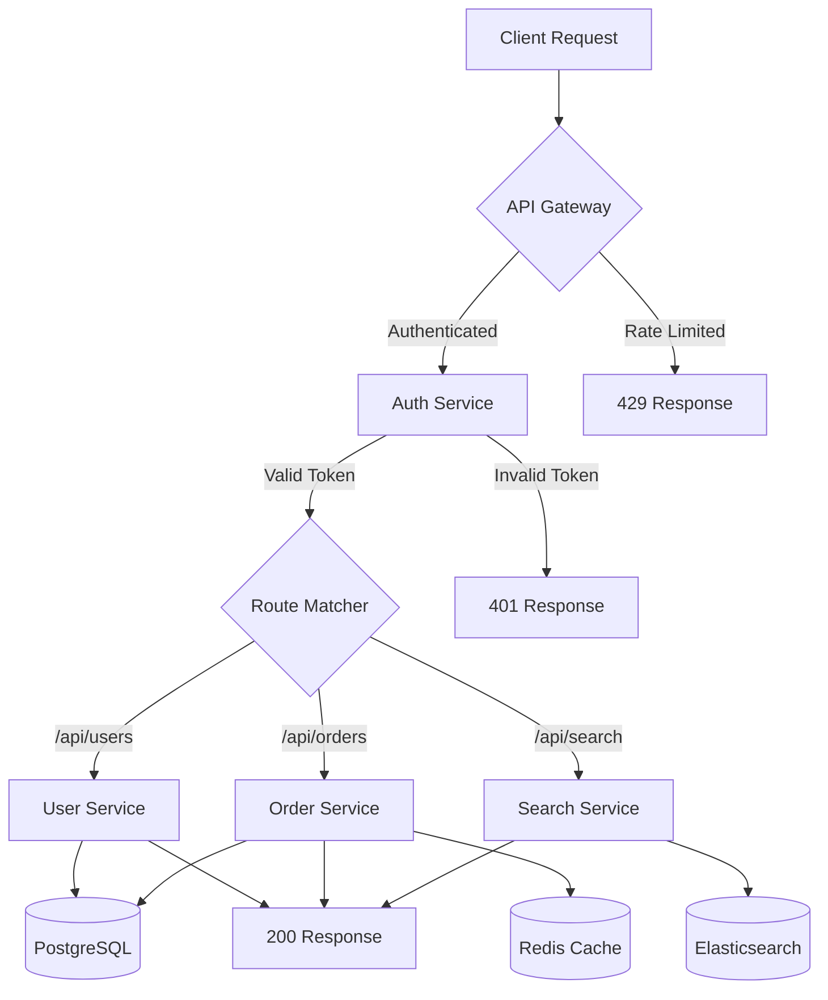
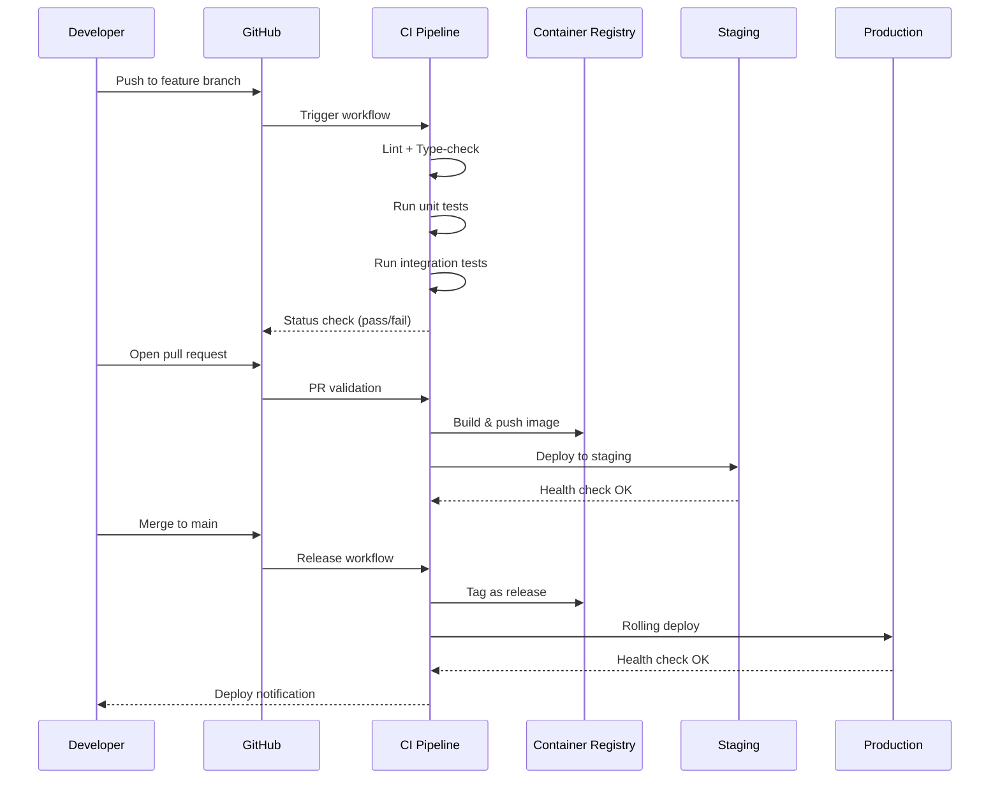
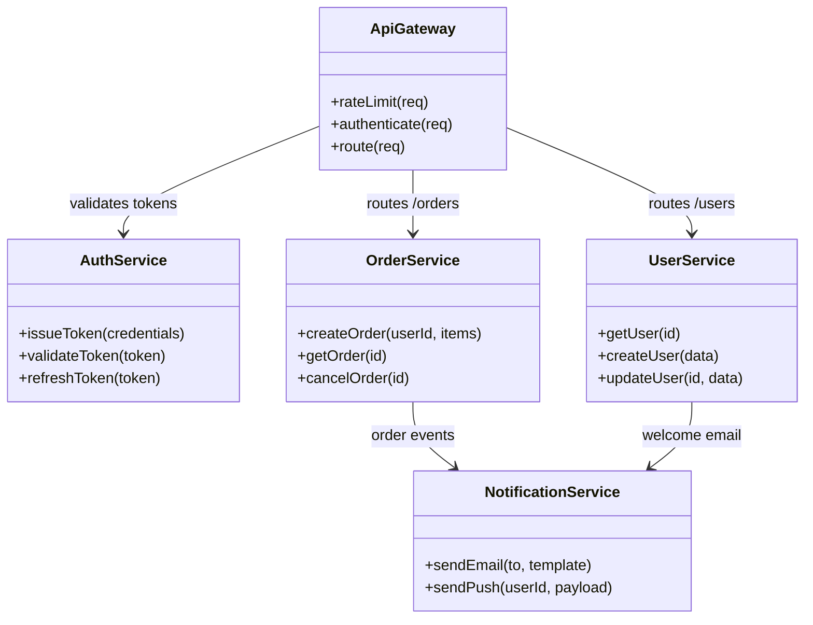
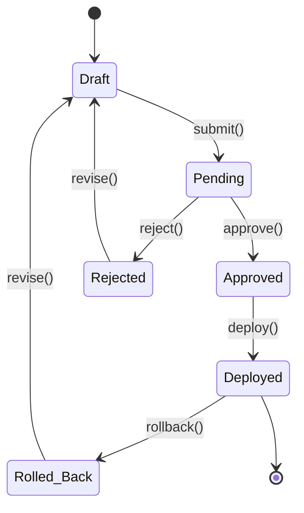
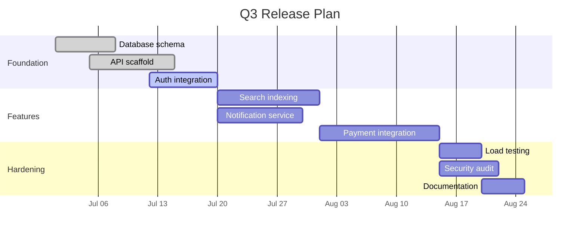
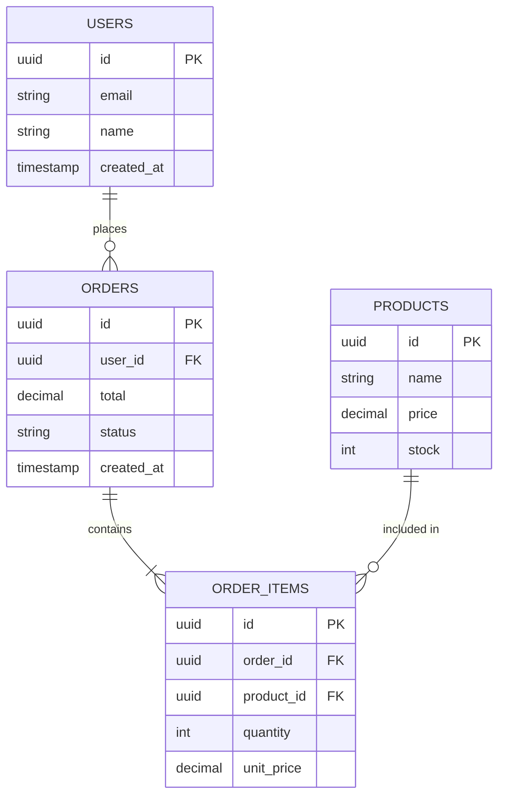

# Project Architecture Overview

A comprehensive developer reference covering every common markdown element — useful as both a syntax cheat-sheet and a rendering test fixture.

---

## Table of Contents

1. [Text Formatting](#text-formatting)
2. [Code](#code)
3. [Links & Images](#links--images)
4. [Lists](#lists)
5. [Tables](#tables)
6. [Blockquotes & Alerts](#blockquotes--alerts)
7. [Mermaid Diagrams](#mermaid-diagrams)
8. [Math & Footnotes](#math--footnotes)
9. [Miscellaneous](#miscellaneous)

---

## Text Formatting

Regular paragraph text. Lorem ipsum dolor sit amet, consectetur adipiscing elit. Inline styles: **bold**, _italic_, **_bold-italic_**, ~~strikethrough~~, `inline code`, and <kbd>Ctrl</kbd>+<kbd>C</kbd> keyboard hints.

Superscript via HTML: x<sup>2</sup> + y<sup>2</sup> = r<sup>2</sup>
Subscript via HTML: H<sub>2</sub>O is water.

> Abbreviations and definitions can be inlined when the renderer supports them.

---

## Code

### Inline

Use `docker compose up -d` to start all services. The config lives in `./infra/compose.yml`.

### Fenced — with language hint

```typescript
interface ApiResponse<T> {
  data: T;
  meta: {
    page: number;
    perPage: number;
    total: number;
  };
  errors?: { code: string; message: string }[];
}

async function fetchUsers(page = 1): Promise<ApiResponse<User[]>> {
  const res = await fetch(`/api/users?page=${page}`);
  if (!res.ok) throw new HttpError(res.status, await res.text());
  return res.json();
}
```

```python
from dataclasses import dataclass, field
from datetime import datetime

@dataclass
class Deployment:
    service: str
    version: str
    replicas: int = 1
    created_at: datetime = field(default_factory=datetime.utcnow)

    @property
    def label(self) -> str:
        return f"{self.service}@{self.version} x{self.replicas}"
```

```sql
-- Active users who signed up in the last 30 days
SELECT u.id, u.email, COUNT(s.id) AS session_count
FROM users u
LEFT JOIN sessions s ON s.user_id = u.id
WHERE u.created_at >= NOW() - INTERVAL '30 days'
  AND u.status = 'active'
GROUP BY u.id, u.email
ORDER BY session_count DESC
LIMIT 20;
```

```bash
#!/usr/bin/env bash
set -euo pipefail

echo "Deploying $SERVICE_NAME v$VERSION..."
docker build -t "$REGISTRY/$SERVICE_NAME:$VERSION" .
docker push "$REGISTRY/$SERVICE_NAME:$VERSION"
kubectl set image "deployment/$SERVICE_NAME" "app=$REGISTRY/$SERVICE_NAME:$VERSION"
echo "Done."
```

### Diff

```diff
- const API_BASE = "http://localhost:3000";
+ const API_BASE = process.env.API_BASE_URL ?? "http://localhost:3000";
```

---

## Links & Images

- [GitHub](https://github.com) — external link
- [Architecture section](#mermaid-diagrams) — anchor link
- <https://example.com/autolinked>

### Image


---

## Lists

### Unordered

- **Auth service** — handles OAuth 2.0 + OIDC flows
  - Token issuance & refresh
  - Session management
- **API gateway** — rate limiting, routing, request validation
- **Worker pool** — background jobs via Redis-backed queues

### Ordered

1. Clone the repository
2. Install dependencies
   ```bash
   npm ci
   ```
3. Copy the environment template
   ```bash
   cp .env.example .env
   ```
4. Start the dev server
   ```bash
   npm run dev
   ```

### Task List

- [x] Set up CI pipeline
- [x] Configure staging environment
- [ ] Add integration tests for payment flow
- [ ] Write runbook for incident response
- [ ] Performance baseline benchmarks

### Nested Mixed

1. **Phase 1 — Foundation**
   - [x] Database schema design
   - [x] API scaffold
   - [ ] Auth integration
2. **Phase 2 — Features**
   - [ ] Search indexing
   - [ ] Notification service
     - Email
     - Push
     - In-app

---

## Tables

### HTTP Status Codes

| Code  | Name                  | When to Use                             |
| ----- | --------------------- | --------------------------------------- |
| `200` | OK                    | Successful GET / PUT                    |
| `201` | Created               | Successful POST that creates a resource |
| `204` | No Content            | Successful DELETE                       |
| `400` | Bad Request           | Validation failure                      |
| `401` | Unauthorized          | Missing or invalid credentials          |
| `403` | Forbidden             | Valid credentials, insufficient scope   |
| `404` | Not Found             | Resource does not exist                 |
| `409` | Conflict              | Duplicate key or state conflict         |
| `429` | Too Many Requests     | Rate limit exceeded                     |
| `500` | Internal Server Error | Unhandled exception                     |

### Environment Matrix

| Variable         | Dev              | Staging                  | Production            |
| ---------------- | ---------------- | ------------------------ | --------------------- |
| `DATABASE_URL`   | `localhost:5432` | `staging-db.internal`    | `prod-db.internal`    |
| `REDIS_URL`      | `localhost:6379` | `staging-cache.internal` | `prod-cache.internal` |
| `LOG_LEVEL`      | `debug`          | `info`                   | `warn`                |
| `RATE_LIMIT_RPS` | `1000`           | `200`                    | `100`                 |
| `FEATURE_FLAGS`  | `all`            | `beta`                   | `stable`              |

---

## Blockquotes & Alerts

> **Note**: Standard blockquote — useful for callouts and asides.

> [!NOTE]
> GitHub-style alert: informational context the reader should be aware of.

> [!TIP]
> Helpful advice for doing things better or more easily.

> [!WARNING]
> Urgent information that requires immediate attention to avoid problems.

> [!CAUTION]
> Advises about risks or negative outcomes of certain actions.

### Nested Blockquote

> The system is designed around three invariants:
>
> > 1. Every write goes through the event log.
> > 2. Reads are eventually consistent within 500 ms.
> > 3. No service holds state longer than one request cycle.

---

## Mermaid Diagrams

### Request Lifecycle — Flowchart



### Deployment Pipeline — Sequence Diagram



### Service Dependencies — Class Diagram



### State Machine — State Diagram



### Release Timeline — Gantt Chart



### Infrastructure — Entity Relationship



---

## Math & Footnotes

### Inline Math

The time complexity is $O(n \log n)$ for the sort step, with $O(n)$ for the linear scan[^1].

### Block Math

$$
\text{P99 Latency} = \mu + z_{0.99} \cdot \sigma \quad \text{where } z_{0.99} \approx 2.326
$$

### Footnotes

[^1]: Assuming a comparison-based sort. Radix sort can achieve $O(nk)$ where $k$ is the key length.

Service mesh overhead is typically 1-2 ms per hop[^2].

[^2]: Based on Linkerd benchmarks — Envoy-based meshes may add 2-5 ms. See [Linkerd Performance](https://linkerd.io/docs/).

---

## Miscellaneous

### Horizontal Rule

Three or more dashes:

---

### Definition-Style (via blockquote convention)

> **Idempotent**
> An operation that produces the same result regardless of how many times it is executed. PUT and DELETE should be idempotent; POST typically is not.

> **Circuit Breaker**
> A stability pattern that prevents cascading failures by temporarily halting requests to a failing downstream service after a threshold of errors is reached.

### Collapsed Detail (HTML)

<details>
<summary>Full error stack trace (click to expand)</summary>

```
Error: ECONNREFUSED 127.0.0.1:5432
    at TCPConnectWrap.afterConnect [as oncomplete] (net.js:1141:16)
    at Protocol._enqueue (protocol.js:350:12)
    at Client.connect (client.js:92:8)
    at Pool._acquireClient (pool.js:45:18)
    at /app/src/db/connection.ts:28:5
    at processTicksAndRejections (internal/process/task_queues.js:95:5)
```

</details>

### Emoji Shortcodes (if supported)

:rocket: Ship it | :bug: Bug | :white_check_mark: Passing | :construction: WIP | :lock: Security

### Escaped Characters

Literal asterisks: \*not bold\*, literal backticks: \`not code\`, literal pipes in text: \| separator \|.

---

_Generated as a rendering test fixture for [markdown-viewer](../markdown-viewer.html)._
